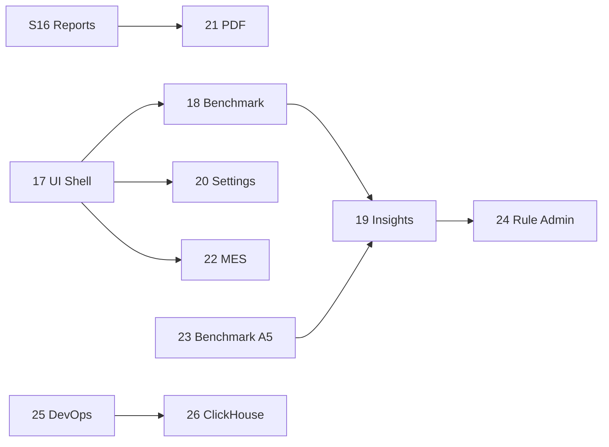

# FilmBench — بک‌لاگ اسپرینتی

این سند ادامهٔ مسیر پیاده‌سازی از **اسپرینت ۱۷** به بعد را مشخص می‌کند. شماره‌گذاری **پیاده‌سازی** (۰–۱۶ در کد) با **بک‌لاگ اصلی سند** (۰–۱۱ در PRD) متفاوت است؛ هر دو در جدول نگاشت پایان سند آمده‌اند.

## قرارداد

| نماد | معنی |
|------|------|
| **T-1xx** | شناسه تسک (xx = شماره اسپرینت × ۱۰ + ترتیب) |
| **→ T-xx** | وابستگی: بعد از تکمیل تسک دیگر |
| **PRD, A1–A6** | منبع الزام (پیوست‌ها و سند محصول) |
| **اختیاری** | خارج از MVP محلی؛ بعد از پایداری |

**تعریف Done (هر اسپرینت):** migration (در صورت نیاز) + API + صفحه/کامپوننت وب + تست/unit حداقلی + `npm run lint` و `npm run build` سبز + به‌روزرسانی یک خط در `apps/web/app/page.tsx` (نسخه اسپرینت فعلی).

---

## انجام‌شده (اسپرینت ۰–۱۶)

| # | عنوان | خروجی کلیدی |
|---|--------|-------------|
| 0 | پایه monorepo، Docker، CI | workspaces، health، `.env.example` |
| 1 | OLTP + KPI پایه | migrations 001–005، `refresh_kpi_results` |
| 2 | Cohort + benchmark view | 006–007، `vw_kpi_benchmark_comparison` |
| 3 | Auth + RBAC | users، JWT، seed demo |
| 4 | Ingestion Excel | batches، template، upload |
| 5 | خواندن KPI (ایندکس) | 012 |
| 6 | تیم + تاریخچه ingestion | admin members، batches list |
| 7 | KPI trends | `/trends`، `kpi-trends` API |
| 8 | CSV export + audit | `audit_events`، export routes |
| 9 | Data quality listing | `/data-quality` |
| 10 | KPI targets | `factory_kpi_targets`، `/targets` |
| 11 | Executive summary | `vw_kpi_below_factory_target`، `/overview` |
| 12 | Improvement actions | `/actions` |
| 13 | Account + health | change password، DB health |
| 14 | Period compare | `/compare`، period-delta |
| 15 | In-app notifications | `/notifications` |
| 16 | Executive CSV reports | `/reports`، `factory_reports` |

---

## باقی‌مانده — اسپرینت ۱۷ تا ۲۵ (MVP کامل نسبت به سند)

### اسپرینت ۱۷ — پوسته UI و ناوبری (A1 §2، §9، §10) ✅

**هدف:** تجربه یکپارچه فرانت؛ دیگر صفحات پراکنده بدون layout مشترک نباشند.

| ID | تسک | منبع | وضعیت |
|----|-----|------|--------|
| T-171 | `AppShell`: Top Nav + Sidebar (لینک همه صفحات موجود) | A1 §2 | ✅ |
| T-172 | `FactoryPeriodContext`: انتخاب کارخانه + دوره در shell (URL + localStorage) | A1 §2.1 | ✅ |
| T-173 | منوی RBAC: مخفی/غیرفعال کردن آیتم برای analyst/manager/admin | A1 §9 | ✅ |
| T-174 | Badge اعلان خوانده‌نشده در nav | A1 Top Nav | ✅ |
| T-175 | Responsive sidebar + CSS tokens | A1 §10–11 | ✅ |

**خروجی:** route group `app/(app)/` با layout مشترک؛ پارامترهای `?factory_id=&reporting_period_id=` در لینک‌های sidebar.

---

### اسپرینت ۱۸ — صفحه Benchmark و فیلتر cohort (A1 §4، A4، A5) ✅

**هدف:** صفحه اختصاصی benchmark (فراتر از dashboard فعلی) با فیلتر و روایت percentile/gap.

| ID | تسک | منبع | وضعیت |
|----|-----|------|--------|
| T-181 | API فیلترها + `filter-options` + percentile در پاسخ | A1 §4.1، A4 | ✅ |
| T-182 | صفحه `/benchmark` | A1 §4 | ✅ |
| T-183 | پنل توزیع p10–p90 و narrative صدک | A4 §11 | ✅ |
| T-184 | Export CSV + لینک trends/compare | A1 | ✅ |

**خروجی:** `GET …/benchmark-comparison?line_type&width_band&cohort_key&comparison_status` و UI `/benchmark`.

---

### اسپرینت ۱۹ — Insight Engine MVP (A6) ✅

**هدف:** insightهای قابل اولویت‌بندی برای داشبورد، overview و گزارش.

| ID | تسک | منبع | وضعیت |
|----|-----|------|--------|
| T-191 | Migration: `insight_rules`, `generated_insights`, `insight_rule_executions` | A6 §7 | ✅ |
| T-192 | Seed ۱۴ rule MVP (گروه‌های A–E) | A6 §15 | ✅ |
| T-193 | `evaluateInsightRules` از KPI + benchmark + validation | A6 §9 | ✅ |
| T-194 | Template + severity + priority score | A6 §11–13 | ✅ |
| T-195 | `POST …/insights/refresh` + `GET …/insights` | PRD L3 | ✅ |
| T-196 | صفحه `/insights` + Track as action | A1 §5 | ✅ |
| T-197 | اعلان `insight_alert` برای critical | Sprint 15 | ✅ |

**خروجی:** ۱۴ rule فعال؛ impact narrative برای Scrap/OEE/energy.

**خارج از MVP (اسپرینت ۲۴):** composite rules، trend rules چندماهه.

---

### اسپرینت ۲۰ — تنظیمات و پروفایل کارخانه (A1 §8) ✅

**هدف:** Settings مطابق wireframe؛ واحد پول و پروفایل کارخانه.

| ID | تسک | منبع | وضعیت |
|----|-----|------|--------|
| T-201 | Migration: `factory_settings` | A1 §8، A4 §8 | ✅ |
| T-202 | `GET/PATCH /v1/factories/:id/settings` (admin only) | A1 | ✅ |
| T-203 | صفحه `/settings`: تب Factory profile | A1 | ✅ |
| T-204 | تب Team → لینک `/team` | A1 §8 | ✅ |
| T-205 | Audit `factory_settings.updated` | PRD L7 | ✅ |

---

### اسپرینت ۲۱ — گزارش PDF (تکمیل T-91) ✅

**هدف:** علاوه بر CSV اسپرینت ۱۶، خروجی PDF قابل اشتراک.

| ID | تسک | منبع | وضعیت |
|----|-----|------|--------|
| T-211 | `pdfkit` در `apps/api` | PRD §6.5 | ✅ |
| T-212 | `buildExecutiveReportPdf` از `executive-data.ts` | A1 Reports | ✅ |
| T-213 | `factory_reports.format` = `csv` \| `pdf`؛ ذخیره و download | T-92 | ✅ |
| T-214 | Audit `report.downloaded` + metadata `format` | PRD L7 | ✅ |
| T-215 | UI `/reports`: انتخاب فرمت، راهنمای/پیش‌نمایش اندازه | A1 §7 | ✅ |

---

### اسپرینت ۲۲ — MES stub و قرارداد یکپارچه‌سازی (PRD L6، T-94) ✅

**هدف:** بدون پیاده‌سازی کامل MES؛ قرارداد ثابت برای فاز بعد.

| ID | تسک | منبع | وضعیت |
|----|-----|------|--------|
| T-221 | `GET /v1/integrations/mes` | PRD L6 | ✅ |
| T-222 | `POST /v1/integrations/mes/events` → `integration_events` | PRD | ✅ |
| T-223 | صفحه `/integrations` + نمونه JSON | PRD | ✅ |
| T-224 | Migration `integration_events` (append-only) | PRD | ✅ |

**خروجی:** قرارداد v1.0.0؛ idempotency با `external_id`؛ audit `integration_event.received`.

---

### اسپرینت ۲۳ — تکمیل سرویس Benchmark (A5) ✅

**هدف:** نزدیک شدن به A5: entity results، execution log، confidence.

| ID | تسک | منبع | وضعیت |
|----|-----|------|--------|
| T-231 | Migration: `benchmark_entity_results`, `benchmark_execution_log` | A5 §4، §19 | ✅ |
| T-232 | `refresh_benchmark_entity_results` + گسترش `refresh_kpis_then_benchmarks` | A5 | ✅ |
| T-233 | Band `leader` / `average` / `laggard` در DB/API | A4 §22، A5 §14 | ✅ |
| T-234 | `confidence_score` + cohort fallback در payload | A4 §14–16 | ✅ |
| T-235 | تست band/confidence/cohort-fallback | A5 §20 | ✅ |

**خروجی:** `POST …/benchmark/refresh`؛ API comparison با فیلدهای A5؛ UI band badge.

---

### اسپرینت ۲۴ — ادمین قوانین Insight (A6 §18، §19) ✅

**هدف:** بخش «Hardening محصول» از بک‌لاگ اصلی ۱۱.

| ID | تسک | منبع | وضعیت |
|----|-----|------|--------|
| T-241 | `GET/PATCH /v1/admin/insight-rules` | A6 §18، §27 | ✅ |
| T-242 | UI `/admin/rules` (factory admin) | A1 | ✅ |
| T-243 | `POST …/insight-rules/:id/regression-test` | A6 §19 | ✅ |
| T-244 | Audit `insight_rule.updated` | PRD L7 | ✅ |

**خروجی:** `min_gap` / `max_percentile` در evaluate؛ تست بدون persist.

---

### اسپرینت ۲۵ — DevOps و استقرار production (PRD L8) ✅

**هدف:** استقرار قابل تکرار روی سرور (فراتر از `npm run dev`).

| ID | تسک | منبع | وضعیت |
|----|-----|------|--------|
| T-251 | `docker-compose.prod.yml` + Dockerfiles | PRD L8 | ✅ |
| T-252 | Job migrate در compose + `Dockerfile.migrate` | PRD | ✅ |
| T-253 | `k8s/` manifests نمونه | PRD | ✅ |
| T-254 | `.github/workflows/deploy.yml` + `docs/DEPLOY.md` | PRD | ✅ |
| T-255 | JSON logs؛ `/health/live` vs `/health/ready` | PRD L8 | ✅ |
| T-256 | `.env.production.example` + env table در DEPLOY | PRD | ✅ |

---

## اختیاری — اسپرینت ۲۶+ (بعد از MVP)

### اسپرینت ۲۶ — ClickHouse + ETL (PRD L5، A3 Option B) ✅

| ID | تسک | منبع | وابستگی | وضعیت |
|----|-----|------|---------|--------|
| T-261 | سرویس ClickHouse در compose؛ schema fact/kpi aggregate | PRD، A3 §19 | Sprint 23 | ✅ |
| T-262 | Job sync شبانه/پس از ingestion از Postgres | PRD | T-261 | ✅ |
| T-263 | تغییر queryهای سنگین trends/benchmark به CH (feature flag) | A1 perf | T-262 | ✅ |

**خروجی:** `@filmbench/analytics`؛ `clickhouse/init`؛ migration `030`؛ `POST/GET …/analytics/sync|status`؛ `docs/ANALYTICS.md`؛ sync پس از upload/benchmark.

### اسپرینت ۲۷ — UX جریان‌های A1 §12 ✅

| ID | تسک | منبع | وضعیت |
|----|-----|------|--------|
| T-271 | First-time onboarding (خالی → upload → dashboard) | A1 §12 | ✅ |
| T-272 | Monthly close checklist (upload → validate → overview → insights → report) | A1 §12 | ✅ |

**خروجی:** `GET …/onboarding-status`؛ `/getting-started`؛ بنر compact در Dashboard.

### اسپرینت ۲۸ — Impact calculator پیشرفته (A6 §14)

| ID | تسک | منبع |
|----|-----|------|
| T-281 | پارامتر margin/energy در settings | A6 §14 | ✅ |
| T-282 | Calculator UI روی کارت insight | A6 §14 | ✅ |

**خروجی:** migration `029`؛ `POST …/impact-calculator`؛ تب Impact در Settings؛ `InsightImpactCalculator` در `/insights`.

---

## نمود وابستگی (خلاصه)

**ترتیب پیشنهادی اجرا:**  
`17 → 18 → 23 → 19 → 20 → 21 → 22 → 24 → 25`  
(اسپرینت ۲۲ و ۲۰ می‌توانند بعد از ۱۷ موازی شوند.)

---

## نگاشت بک‌لاگ اصلی (۰–۱۱) → پیاده‌سازی

| اصلی | موضوع | پوشش فعلی | اسپرینت(های) باقی‌مانده |
|------|--------|-----------|-------------------------|
| 0–4 | پایه تا ingestion | ✅ ۰–۴، ۶–۷ | — |
| 5 | Benchmark کامل | جزئی (view + refresh) | **۲۳**، بخشی **۱۸** |
| 6 | Insight Engine | ❌ | **۱۹**، **۲۴** |
| 7 | REST + Audit | ✅ | — |
| 8 | UI کامل A1 | جزئی (صفحات بدون shell) | **۱۷**، **۱۸**، **۲۰** |
| 9 | PDF + Notify + MES | notify ✅، CSV ✅ | **۲۱**، **۲۲** |
| 10 | ClickHouse | ❌ | **۲۶** (اختیاری) |
| 11 | Hardening / DevOps | جزئی (health) | **۲۴**، **۲۵** |

---

## برآورد حجم

| دسته | تعداد اسپرینت | تخمین تسک |
|------|----------------|-----------|
| MVP باقی‌مانده (۱۷–۲۵) | **۹** | ~۴۵ تسک |
| اختیاری (۲۶–۲۸) | **۳** | ~۱۰ تسک |
| **جمع برای MVP سند** | **۹ اسپرینت بعد از ۱۶** | |

---

## چک‌لیست قبل از شروع هر اسپرینت

1. خواندن بخش مرتبط در `docs/BACKLOG.md` و منبع A1/A6/…
2. `npm run db:migrate` پس از migration جدید
3. به‌روزرسانی `packages/db/src/migrate.test.ts` برای فایل SQL جدید
4. ثبت route در `apps/api/src/router.ts`
5. صفحه وب + لینک در shell (بعد از اسپرینت ۱۷: فقط داخل `AppShell`)
6. `npm test && npm run lint && npm run build`

---

## مرجع

- بک‌لاگ اولیه و نگاشت سند: ترنسکریپت [794846f7-77bb-47ec-ad0e-2de741ce139c](794846f7-77bb-47ec-ad0e-2de741ce139c)
- مسیر پیاده‌سازی ۸–۱۶: چت [515d1275-ef00-458d-aa28-d6c1818ebdb6](515d1275-ef00-458d-aa28-d6c1818ebdb6)
